##

Notes from Designing Data-Intensive Applications

##

Reliability

Scalability

Maintainability -> Operability, Simplicity, Evolvability

##

Object-relational mapping (ORM) frameworks - Active Record & Hibernate

##

Document Model -> One-to-Many Relationships

Relational Model -> Many-to-Many Relationships

##

SQL is a declarative query languages (as opposed to being imperative code)

Many used programming languages are imperative

##

Relational Model

Non-relational "NoSQL" datastores -> Document databases, Graph databases

##

##

Online transaction processing (OLTP)

Online Analytic Processing (OLAP)

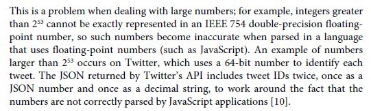

REST (Representational State Transfer)
SOAP (Simple Object Access Protocol)
RPC (Remote Procedure Call)

Remote Procedure Call (RPC)

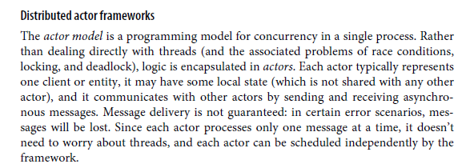

###

Replication

Semi-synchronous configuration (1 Master, 1 Synchronous Follower, 1 Asynchronous Follower)

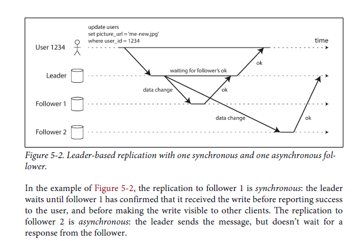

Setting up New Followers

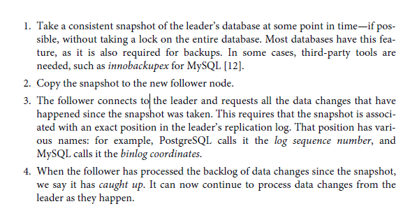

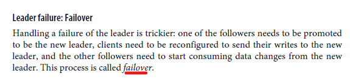

Write-ahead log (WAL) shipping - PostgreSQL, Oracle
Logical (row-based) log replication
Trigger-based replication

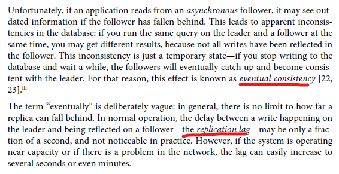

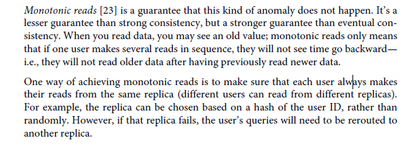

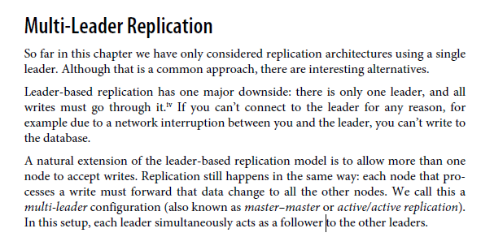

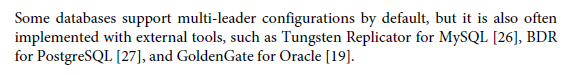

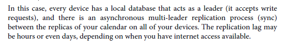

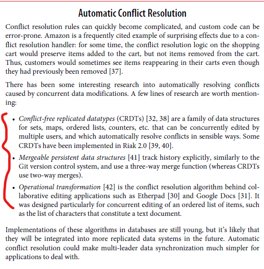

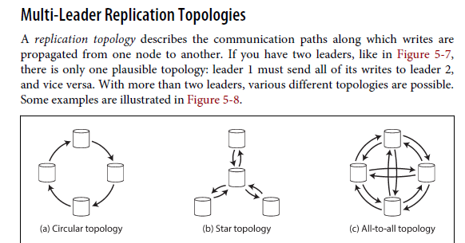

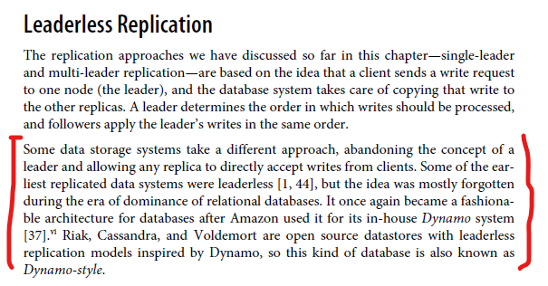

###

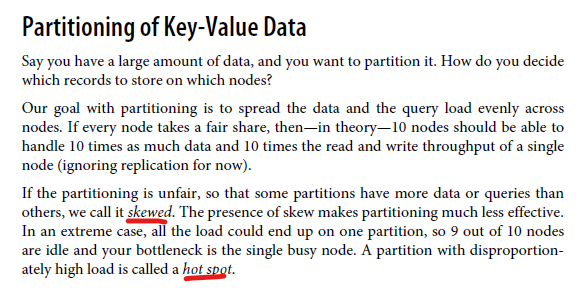

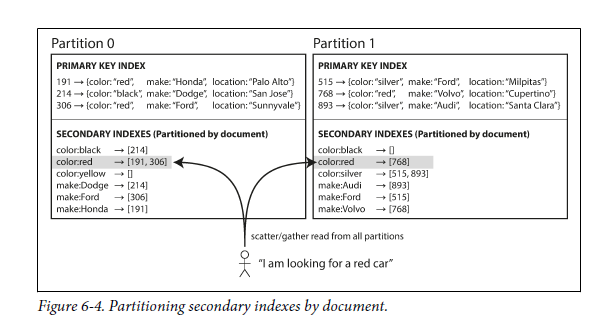

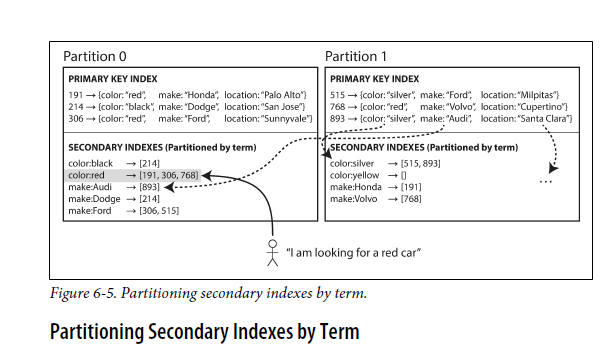
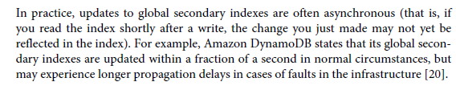

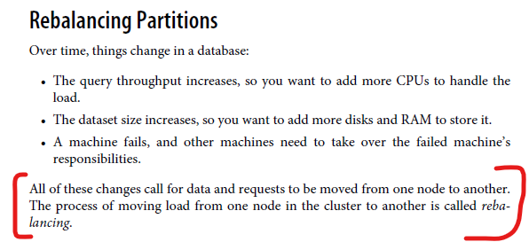

###

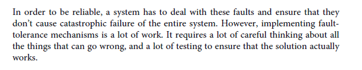

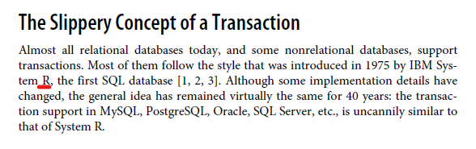

ACID (Atomicity, Consistency, Isolation, Durability)
BASE (Basically Available, Soft state, Eventual Consistency) - Systems that do not meet ACID criteria

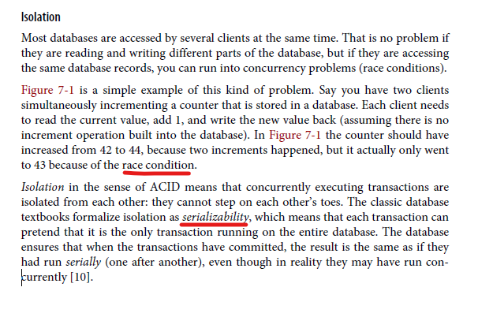

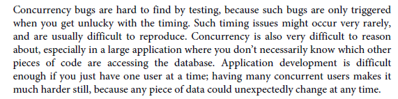

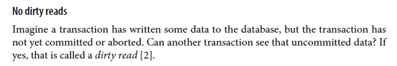

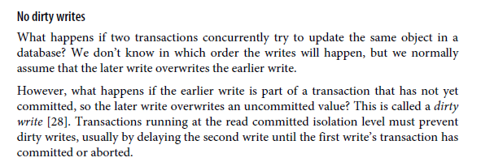

Multi-Version Concurrency Control (MVCC)

Last Write Wins (LWW)

###

Use Queues to avoid concurrency

###

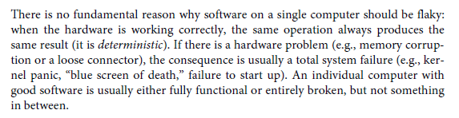

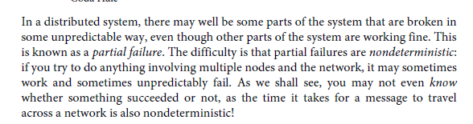

Remote Direct Memory Access (RDMA)

Network Time Protocol (NTP)

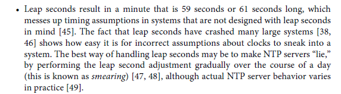

Precision Time Protocol (PTP)

Java Virtual Machine (JVM)

Garbage Collector (GC)

Real-Time Operating System (RTOS)

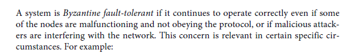

Safety means "nothing bad ever happens"
Liveness means "something good eventually happens"

###

Consistency Models:

- Linearizability (Atomic Consistency, Strong Consistency, Immediate Consistency, External Consistency) - The basic idea behind linearizability is simple: to make a system appear as if there is only a single copy of the data.

Oracle Real Application Clusters (RAC)

**Total order broadcast** is usually described as a protocol for exchanging messages between nodes.

Two-Phase Commit (2PC) Algorithm

Two-phase commit is an algorithm for achieving atomic transaction commit across multiple nodes—i.e., to ensure that either all nodes commit or all nodes abort.

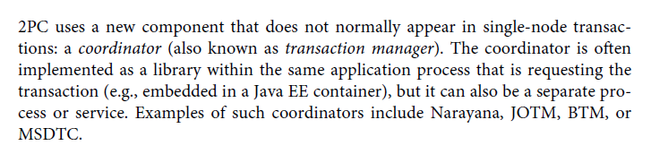

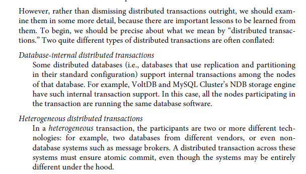

Hadoop Distributed File System (HDFS)

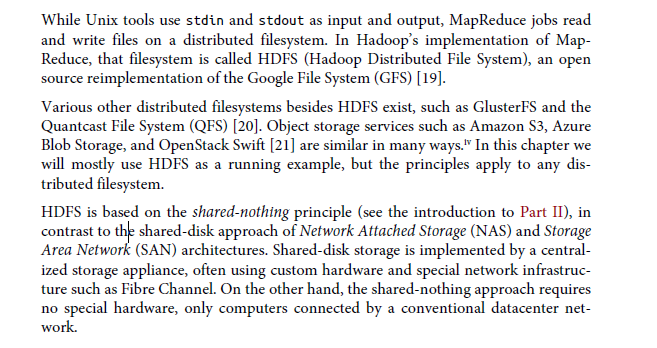

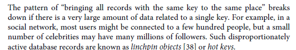

Transmission Control Protocol (TCP)

User Datagram Protocol (UDP)

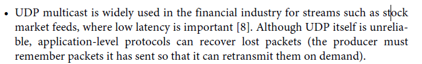

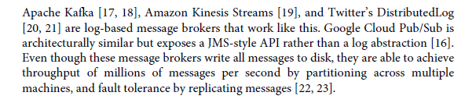

Change Data Capture (CDC)

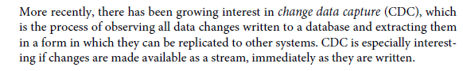
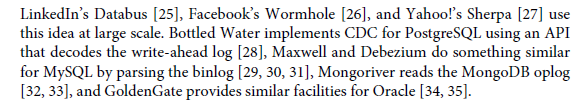

Domain-Driven Design (DDD)

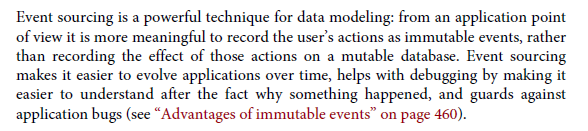

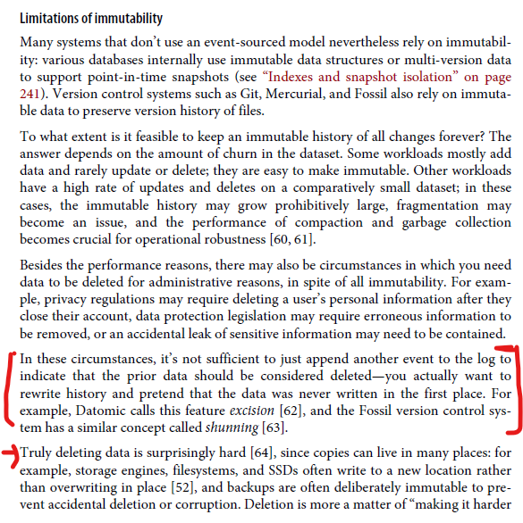

Deletion is more a matter of “making it harder to retrieve the data” than actually “making it impossible to retrieve the data.”

Complex event processing (CEP)

