##

Reliability

Scalability

Maintainability -> Operability, Simplicity, Evolvability

##

Object-relational mapping (ORM) frameworks - Active Record & Hibernate

##

Document Model -> One-to-Many Relationships

Relational Model -> Many-to-Many Relationships

##

SQL is a declarative query languages (as opposed to being imperative code)

Many used programming languages are imperative

##

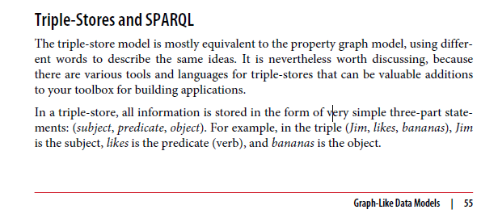

Relational Model

Non-relational "NoSQL" datastores -> Document databases, Graph databases

##

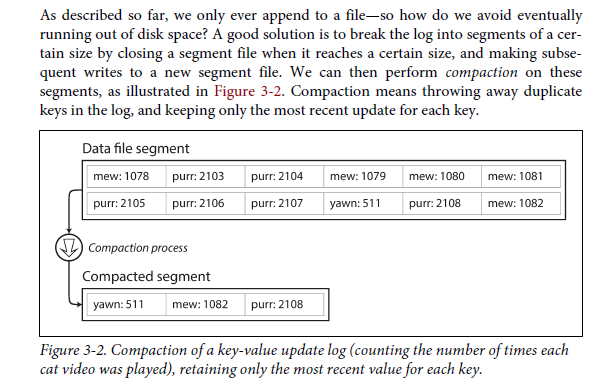

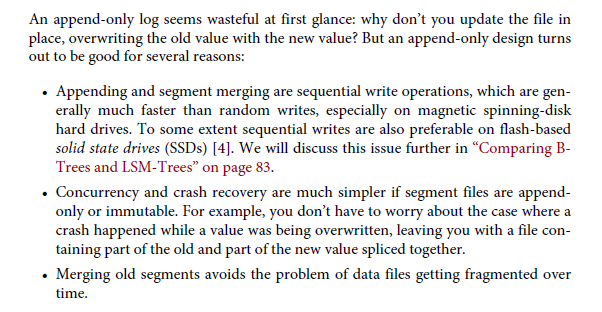

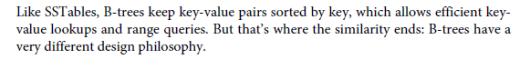

##

Online transaction processing (OLTP)

Online Analytic Processing (OLAP)

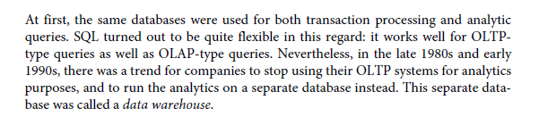
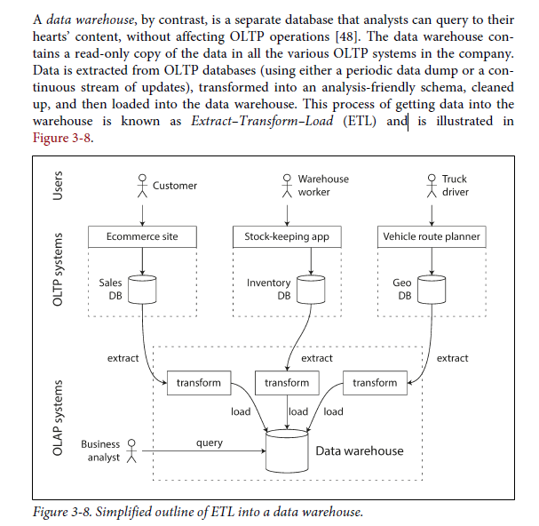

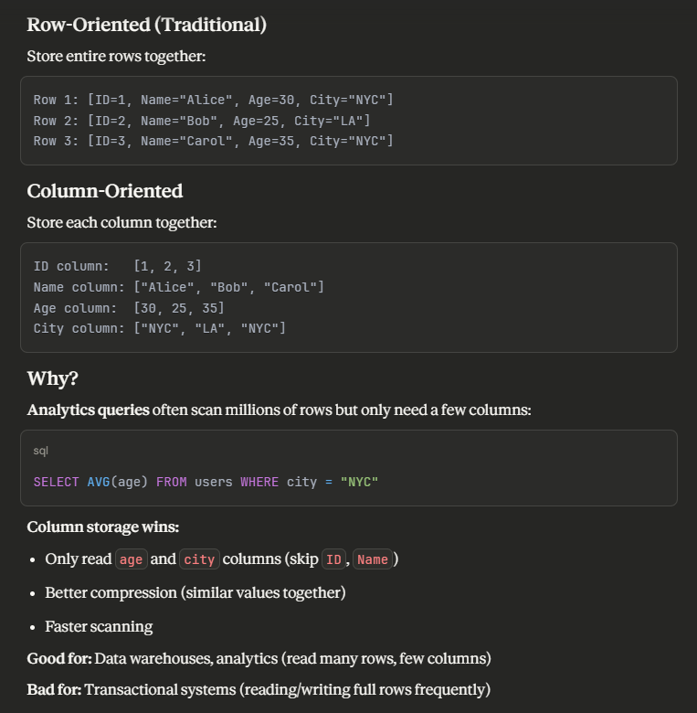

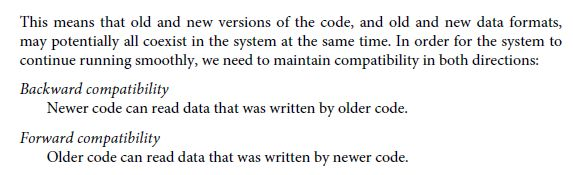

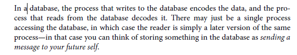

REST (Representational State Transfer)
SOAP (Simple Object Access Protocol)
RPC (Remote Procedure Call)

Remote Procedure Call (RPC)

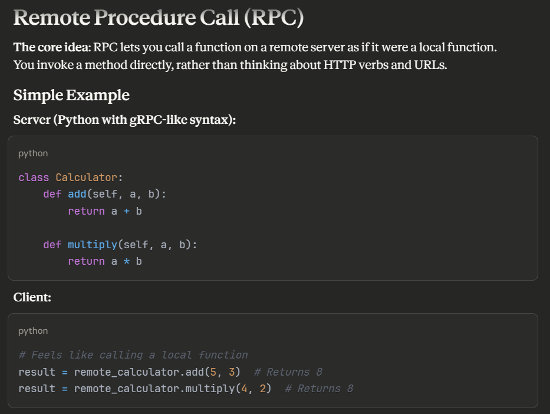
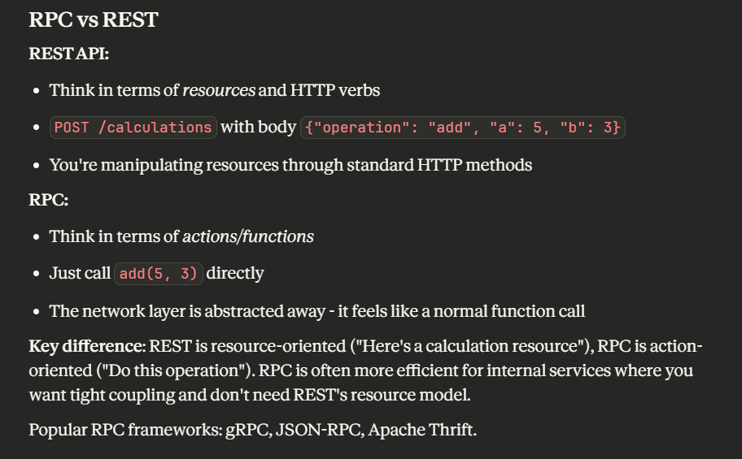
