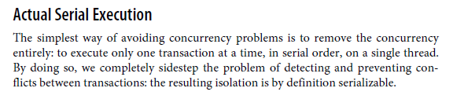

##

- Reliability
- Scalability
- Maintainability -> Operability, Simplicity, Evolvability

##

- Object-relational mapping (ORM) frameworks - Active Record & Hibernate

##

- Document Model -> One-to-Many Relationships
- Relational Model -> Many-to-Many Relationships

##

- SQL is a declarative query languages (as opposed to being imperative code)
- Many used programming languages are imperative

- Declarative vs Imperative:

- 

- 

- Relational Model
- Non-relational "NoSQL" datastores -> Document databases, Graph databases
